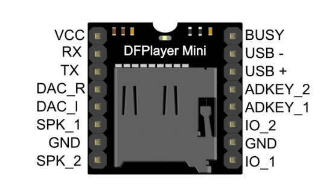

# micropython-dfplayer

Micropython implementation of DFPlayer control using UART 1 (secondary Serial connection)

To use, wire up the DFPlayer Mini MP3 breakout module following this loom...



* DFPlayer Mini
    * VCC           => 5V Vin
    * All GND pins  => GND
    * RX Pin (immediately below VCC)      => GPIO0 (NodeMCU D3)
    * Busy Pin (immediately opposite VCC) => GPIO2 (NodeMCU D4)
    * SPK1+SPK2 to a 3W speaker (limiting the volume to 0.5 can help prevent brownout for larger wattage speakers)
    * ...or...
    * DAC_R+DAC_L to a 3.5mm Line Out Jack

The following example code uses the ScanPlayer. 

It will first scan all available folders for files called 000_XXX.mp3 001_XXX.mp3 and so on.

It considers only folders named 00-09.

It will play a single track from each folder in turn, only repeating a folder 
when all folders are exhausted, and only repeating a track when all tracks have been exhausted. 

```python
from time import sleep
import scanplayer
player = scanplayer.ScanPlayer()
availableFolders = list(player.tracks.keys())
keyPos = 0
while True:
    folder = availableFolders[keyPos]
    player.playFolder(folder)
    while player.playing():
        sleep(0.1)
    keyPos = (keyPos + 1) %  len(availableFolders)
```


